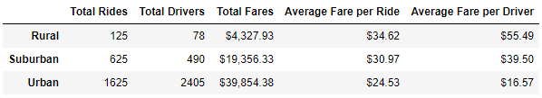
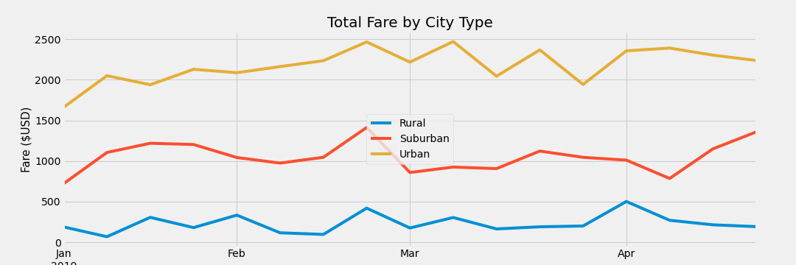

# PyBer Analysis

## Challenge Overview
You are given an assignment to create a summary of the ride-sharing data by city type. You will also create a multiple-line graph that shows the total weekly fares for each city type.

## Resources
- Data Source: city_data.csv, ride_data.csv
- Software: Anaconda 4.8.3, Jupyter Notebook 6.0.3, Python 3.7.7, Visual Studio Code 1.47.2

## Challenge Results

As you can see from the table above, total number of rides, total number of drivers, and total fares increases from rural to suburban to urban cities. This is because as city population gets higher, you can expect the need for more drivers and therefore more rides. Thus, total fares would increase with population as well.

Average fare per ride and average fare per driver have the opposite relationship; these decrease as city population increases. This is due to the supply and demand for drivers and riders. Since there will be less people in rural cities, we can expect less riders and less drivers than suburban and urban cities. Because there is less riders, the drivers compensate by raising fares.

Looking at the graph above, we can see that urban cities has the highest total fares, followed by suburban cities, and lastly rural cities. This is because urban cities have higher population, thus more riders and drivers, thus totaling more fares. This is less in suburban cities and even less in rural cities, given that population decreases in suburban cities and decreases further in rural cities.

## Challenge Summary
